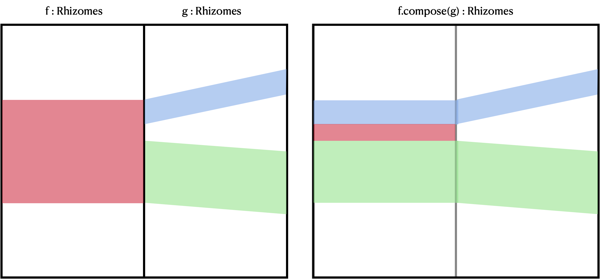

# rhizomes

Implementation of a data structure for composable text ranges.

A `Rhizome` consists of an origin and destination `Interval`, where `Intervals`
have a basis, a start integer, and an end integer. The basis is any type with
a string `id`. A `Rhizomes` object consists of a list of `Ribbons`.

In this project a `monoid` is defined on the type `Rhizomes`, under the method
`Rhizomes#compose`.
